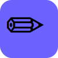

# 🎨 Doodle 



Doodle is a full-stack, real-time drawing canvas application built with the MERN stack and Socket.IO. It provides a smooth, feature-rich sketching experience with automatic cloud saving and user authentication.

---

## ✨ Features

*   **Freehand Drawing:** Smooth pen tool utilizing quadratic bezier curves.
*   **Shape Tools:** Draw rectangles, ellipses, triangles, lines, and arrows.
*   **Text Tool:** Add text annotations directly onto the canvas.
*   **Rich Properties:** Fully customizable stroke colors, fill colors, stroke widths, opacities, and font sizes.
*   **Undo / Redo:** Full history stack mapped to standard keyboard shortcuts (Ctrl+Z / Ctrl+Y).
*   **Auto-Save & Real-time Sync:** Every stroke is synced to the cloud via WebSockets (Socket.IO).
*   **Dashboard:** View all your saved drawings in a grid with auto-generated thumbnail previews.
*   **Authentication:** 
    *   Traditional Email/Password sign up with bcrypt hashing and live password strength indicator.
    *   Google OAuth 2.0 integration for quick access.
    *   Secure stateless API authentication using JWTs and persisted server sessions using MongoDB.
*   **Export:** Download your canvas as a high-quality PNG image.

---

## 🛠️ Tech Stack

**Frontend:**
*   **React (Vite)** - Fast, modern UI development.
*   **React Router** - Client-side routing with protected routes.
*   **HTML5 Canvas API** - Core drawing engine rendering complex bezier curves and polygons.
*   **Axios** - API requests with JWT interceptors.

**Backend:**
*   **Node.js & Express** - Robust REST API backend.
*   **MongoDB & Mongoose** - Database and Object Data Modeling (ODM).
*   **Socket.IO** - Real-time bidirectional event-based communication.
*   **Passport.js** - Authentication middleware (Local & Google OAuth strategies).
*   **Zod** - Schema validation for incoming request data.

---

## 🚀 Running Locally

To run Doodle on your local machine, follow these steps:

### 1. Clone the repository
```bash
git clone https://github.com/Krypto-Knight-05/Doodle.git
cd Doodle
```

### 2. Install Dependencies

**Backend:**
```bash
cd backend
npm install
```

**Frontend:**
```bash
cd ../client
npm install
```

### 3. Environment Variables
Create a `.env` file in the `backend/` directory with the following variables:

```env
PORT=4444
DB_URL=mongodb://localhost:27017/doodle  # Or your MongoDB Atlas URL
CORS_ORIGIN=http://localhost:5173
SESSION_SECRET=your_super_secret_session_key
JWT_SECRET=your_super_secret_jwt_key

# Optional: For Google Login
GOOGLE_CLIENT_ID=your_google_client_id
GOOGLE_CLIENT_SECRET=your_google_client_secret
GOOGLE_CALLBACK_URL=http://localhost:4444/api/auth/google/callback
```

### 4. Start the Development Servers

Open two terminals.

**Terminal 1 (Backend):**
```bash
cd backend
npm run dev
```

**Terminal 2 (Frontend):**
```bash
cd client
npm run dev
```

Your app will be running at `http://localhost:5173`.

---

## 🌐 Deployment

Doodle is fully configured for cloud deployment:
*   **Frontend:** Deployed on [Vercel](https://vercel.com/) (using `vercel.json` for React Router rewrite support).
*   **Backend:** Deployed on [Render](https://render.com/) as a Node Web Service.
*   **Database:** Hosted on [MongoDB Atlas](https://www.mongodb.com/atlas).

> **Note on WebSockets & Vercel:** Vercel utilizes serverless functions, which do not support the persistent connections required by WebSockets. This is why the backend must be deployed to a traditional hosting provider like Render or Railway.
